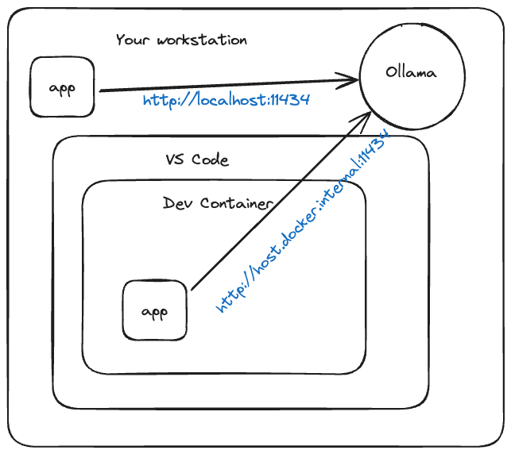
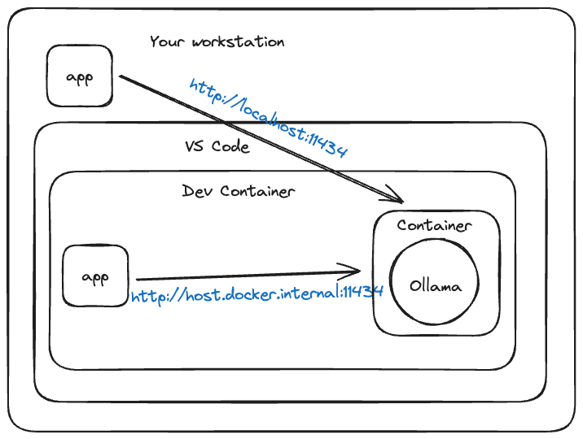

# Go Docker GenAI Stack 🩵🐳🤖🦜🔗🦙
> LangChainGo training

> 👋 you can use this project with [Visual Studio Code Dev Containers](https://code.visualstudio.com/docs/devcontainers/containers). Take a look at the `.devcontainer.json` file. The Docker image is defined int this repository [https://github.com/genai-for-all/go-workspace](https://github.com/genai-for-all/go-workspace).


## First

✋ Start this project with **Dev Container**

## Start Ollama and download a LLM

You can run Ollama in a container or use the official Ollama installer to install Ollama directly on your workstation.

### Use the usual Ollama setup

If you installed Ollama on your workstation with the official Ollama installer, now you can check from the Dev Container project if Ollama is running with the following command:

```bash
curl http://host.docker.internal:11434
# response: Ollama is running
```

> **Remark**: we are using Dev Container, that means we are working **from a container**, so to access the URL http://localhost:11434 (the Ollama default URL), we need to use this DNS: `host.docker.internal`. Your application is running in a container and Ollama is running outside any container.




### Start Ollama in a container

At the root of the project, type the following command
```bash
LLM=gemma docker compose --file compose.ollama.yaml up
```
> The first time, the **gemma** LLM is downloaded (it could take a moment depending your bandwidth)

> **Remark**: If you are running Ollama in a container, and inside Dev Container, your application (running in Dev Container) will reach the Ollama service with this URL: http://host.docker.internal:11434




> **good to know:** ✋ How to fix `permission denied while trying to connect to the Docker daemon socket at unix:///var/run/docker.sock`:
> ```bash
> sudo chmod 666 /var/run/docker.sock
> ```

### Check if Ollama is running:
```bash
curl http://host.docker.internal:11434
# response: Ollama is running
```

### Query Ollama

> https://github.com/ollama/ollama/blob/main/docs/api.md


```bash
curl http://host.docker.internal:11434/api/generate -d '{
  "model": "gemma",
  "prompt": "Who is James T Kirk?",
  "stream": false
}'
```

#### Use it with jq
```bash
curl http://host.docker.internal:11434/api/generate -d '{
  "model": "gemma",
  "prompt": "Who is James T Kirk?",
  "stream": false
}' | jq '.response'
```

#### Use streaming
```bash
curl http://host.docker.internal:11434/api/generate -d '{
  "model": "gemma",
  "prompt": "Who is James T Kirk?"
}' 
```

## Deploy a GenAI app with Docker compose
> from Dev Container or not

## Run all in containers

```bash
HTTP_PORT=8888 LLM=deepseek-coder OLLAMA_BASE_URL=http://ollama:11434 docker compose --profile container up
```
> The first time only, you must wait for the complete downloading of the model.

## Use the native Ollama install (like on macOS)

> To do for the first time only:
```bash
LLM=deepseek-coder ollama pull ${LLM}
```

```bash
HTTP_PORT=8888 LLM=deepseek-coder OLLAMA_BASE_URL=http://host.docker.internal:11434 docker compose --profile webapp up
```

## Use the GPU from the Ollama container on Linux or Windows

> 🚧 This is a work in progress


## Rebuild the WebApp image

> All in containers
```bash
HTTP_PORT=8888 LLM=deepseek-coder OLLAMA_BASE_URL=http://ollama:11434 docker compose --profile container up --build
```

> Use the Ollama local install (like on macOS)
```bash
HTTP_PORT=8888 LLM=deepseek-coder OLLAMA_BASE_URL=http://host.docker.internal:11434 docker compose --profile webapp up --build
```

## Development mode

For developping the application, use the `watch` command of Docker Compose

> All in containers
```bash
HTTP_PORT=8888 LLM=deepseek-coder OLLAMA_BASE_URL=http://ollama:11434 docker compose --profile container watch
```
> Use the Ollama local install (like on macOS)
```bash
HTTP_PORT=8888 LLM=deepseek-coder OLLAMA_BASE_URL=http://host.docker.internal:11434 docker compose --profile webapp watch
```

